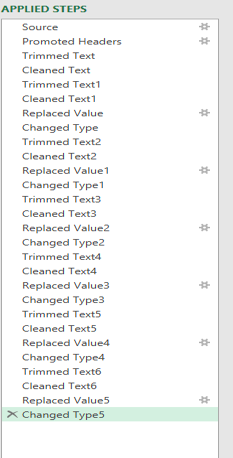
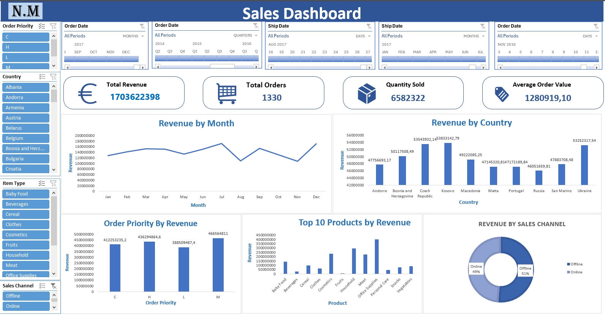

# Sales-Data-Analysis-Interactive-Excel-Dashboard

## Project Overview
This project focuses on cleaning, transforming, analysing, and visualising a large sales dataset using Microsoft Excel and Power Query. The dataset was obtained from Kaggle in CSV format. Before loading the data into Excel for analysis, the dataset was imported and prepared using Power Query.
The data preparation process included reviewing data types, cleaning text values, trimming unnecessary spaces, replacing inconsistent values, and applying appropriate data types. After the data was cleaned and transformed, it was loaded into Excel for analysis using PivotTables and PivotCharts. An interactive sales dashboard was then developed using KPI cards, charts, slicers, and timelines.

## Objectives
The main objectives of this project were to:
- Work with a large sales dataset obtained from Kaggle.
- Import the CSV dataset using Power Query.
- Review and validate data types before loading the data.
- Clean and transform the raw dataset.
- Remove unnecessary spaces and clean text values.
- Replace inconsistent values.
- Apply appropriate data types.
- Prepare the dataset for analysis.
- Create PivotTables and PivotCharts.
- Develop an interactive sales dashboard.
- Analyse revenue, orders, products, countries, sales channels, and sales trends.

## Data Source
The dataset was obtained from **Kaggle** and provided in CSV format.
The raw dataset was imported into Excel using Power Query and prepared before analysis.

## Data Cleaning & Transformation
Power Query was used to clean and transform the dataset before it was loaded into Excel.
The transformation process included:
- Importing the CSV source.
- Promoting the first row to headers.
- Reviewing data types.
- Trimming unnecessary spaces.
- Cleaning text values.
- Replacing inconsistent values.
- Changing columns to appropriate data types.
- Applying multiple transformation steps to prepare the dataset for analysis.

### Power Query Applied Steps

The Applied Steps demonstrate the sequence of transformations performed during the data preparation stage.

## Excel Analysis
After the dataset was cleaned and transformed, it was loaded into Excel for analysis.
PivotTables and PivotCharts were used to analyse different aspects of the sales data, including:
- Revenue
- Orders
- Quantity sold
- Average order value
- Monthly revenue
- Revenue by country
- Revenue by order priority
- Product performance
- Revenue by sales channel

## Interactive Sales Dashboard
An interactive sales dashboard was developed to present the analysis in a clear and user-friendly format.

### Key Performance Indicators
The dashboard includes:
- **Total Revenue**
- **Total Orders**
- **Quantity Sold**
- **Average Order Value**

### Dashboard Visualisations
The dashboard includes:

- Revenue by Month
- Revenue by Country
- Revenue by Order Priority
- Top 10 Products by Revenue
- Revenue by Sales Channel

### Interactive Slicers
Slicers were added to allow users to filter the dashboard by:
- Order Priority
- Country
- Item Type
- Sales Channel

### Timelines
Timelines were added for:
- Order Date
- Ship Date
The slicers and timelines were connected to the relevant PivotTables, allowing the dashboard visualisations and KPIs to update interactively when different filters or time periods are selected.

### Dashboard Preview

## Project Workflow
The project followed this workflow:
1. Downloaded a large sales dataset from Kaggle.
2. Imported the CSV dataset using Power Query.
3. Reviewed the data types before loading the data.
4. Cleaned and transformed the raw data.
5. Trimmed unnecessary spaces and cleaned text values.
6. Replaced inconsistent values.
7. Changed columns to appropriate data types.
8. Loaded the prepared dataset into Excel.
9. Created PivotTables for analysis.
10. Created PivotCharts to visualise the results.
11. Created KPI cards for key sales metrics.
12. Added interactive slicers.
13. Added Order Date and Ship Date timelines.
14. Connected slicers and timelines to the relevant PivotTables.
15. Developed an interactive sales dashboard.

## Skills Demonstrated
### Power Query
- CSV data import
- Data type validation
- Data cleaning
- Text cleaning
- Trimming text
- Replacing values
- Data transformation
- Data preparation

### Microsoft Excel
- PivotTables
- PivotCharts
- KPI creation
- Interactive dashboards
- Slicers
- Timelines
- Connecting slicers to multiple PivotTables
- Connecting timelines to PivotTables
- Data summarisation
- Sales trend analysis
- Revenue analysis
- Product performance analysis
- Business data visualisation

## Tools Used
- **Microsoft Excel**
- **Power Query**
- **CSV**
- **Kaggle**
